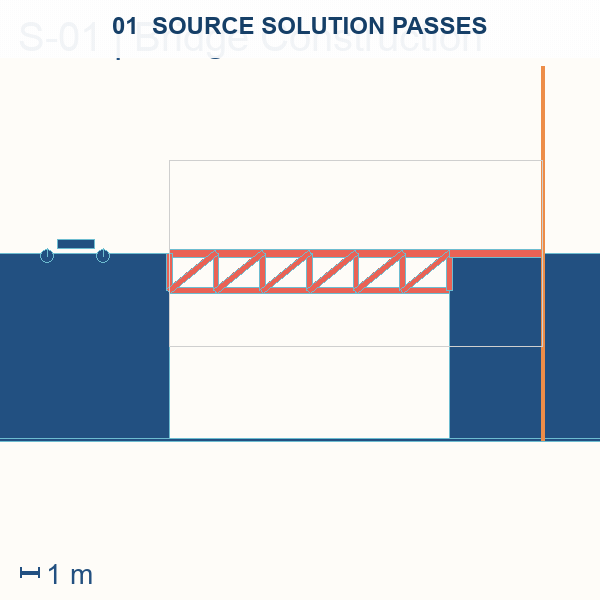

# PACE-Bench

<p align="center">
  <strong>Benchmarking Physics Adaptation via Code Evolution in Dynamic Environments</strong>
</p>

<p align="center">
  <a href="LICENSE"></a>
  <a href="https://www.python.org/"></a>
  <a href="https://arxiv.org/pdf/2608.14441"></a>
  <a href="https://huggingface.co/datasets/YuhaoZhan/PACE-Bench"></a>
</p>

<p align="center">
  <strong><a href="https://huggingface.co/datasets/YuhaoZhan/PACE-Bench">Dataset</a></strong> ·
  <strong><a href="https://arxiv.org/abs/2608.14441">Paper</a></strong> ·
  <strong><a href="#2-quick-start">Quick Start</a></strong> ·
  <strong><a href="#6-validation-and-results">Results</a></strong> ·
  <strong><a href="LICENSE">License</a></strong>
</p>

## 1. Overview

Self-evolving agents improve future behavior from interaction experience, yet existing evaluations typically keep execution conditions fixed. **PACE-Bench** tests whether an agent can adapt a previously successful code-driven design after an environment shift causes it to fail.

Each of our **144 source-to-target adaptation pairs** keeps the task goal and interface fixed:

1. A **code-driven design** succeeds in the source environment.
2. The same design fails in a **mutated target environment**.
3. The agent uses **diagnostic sandbox feedback** to revise the design.
4. The adapted design must succeed under the target physics.

<p align="center">
  
</p>

<p align="center"><em>S-01 Bridge Construction: source pass → target failure → self-evolution → target pass.</em></p>

| Scale | Count |
| --- | ---: |
| Physics domains | 6 |
| Base tasks | 36 |
| Environments per task | 5 |
| Evaluation environments | 180 |
| Source-to-target pairs | 144 |

The benchmark covers **statics, kinematics, dynamics, granular/fluid interaction, control, and exotic physics**. Every task has one source environment and four increasingly difficult target mutations. Reference solutions verify target solvability and source-design failure after mutation.

## 2. Quick Start

PACE-Bench requires **Python 3.10**. Install [uv](https://docs.astral.sh/uv/), then run:

```bash
git clone https://github.com/thunlp/PACE-Bench.git
cd PACE-Bench

uv venv .venv --python 3.10
source .venv/bin/activate  # Windows: .venv\Scripts\activate
uv pip install -r requirements.txt

pace-bench list --task S_01
pace-bench validate --task S_01
```

Smoke-test the complete evaluation path without model calls:

```bash
pace-bench evaluate --task S_01 --env Stage-1 \
  --method vanilla --provider mock --model mock \
  --attempts 1 --runs 1 --output results/smoke --no-resume
```

For headless Linux:

```bash
export SDL_VIDEODRIVER=dummy
export SDL_AUDIODRIVER=dummy
export PYGAME_HIDE_SUPPORT_PROMPT=1
```

## 3. Evaluate a model

### 3.1 API-hosted model

```bash
export OPENAI_API_KEY=<your-key>
pace-bench evaluate --task S_01 --env Stage-1 \
  --method vanilla --provider openai-compatible --model <model-name> \
  --attempts 20 --runs 2 --save-gif --output results/my-run
```

- `--save-gif` records every verified attempt as an animation; JSON is always saved.
- `--base-url http://host:port/v1` selects another OpenAI-compatible endpoint.

### 3.2 Local model

PACE-Bench supports two local paths:

| Provider | Use |
| --- | --- |
| `vllm` | Recommended local or cluster serving over HTTP |
| `local-transformers` | Direct in-process Transformers loading |

Run vLLM in its own Linux/GPU environment following the [official installation guide](https://docs.vllm.ai/en/latest/getting_started/installation/):

```bash
# Serving host
vllm serve Qwen/Qwen2.5-Coder-7B-Instruct \
  --dtype auto --generation-config vllm

# Benchmark host
pace-bench evaluate --task K_03 --env Stage-2 \
  --method vanilla --provider vllm \
  --model Qwen/Qwen2.5-Coder-7B-Instruct \
  --attempts 20 --runs 2 --output results/qwen-vllm
```

- `--model` must match the served model ID.
- `--base-url` or `VLLM_BASE_URL` selects a remote endpoint.
- `--api-key` or `VLLM_API_KEY` supplies server authentication.
- `--workers N` runs trajectories concurrently; Box2D verification remains serialized within each process.

Direct Transformers loading:

```bash
pace-bench evaluate --task K_03 --env Stage-2 \
  --method vanilla --provider local-transformers --model /path/to/model \
  --device cuda:0 --attempts 20
```

Use `--device mps`, `--device cpu`, or `--devices cuda:0,cuda:1 --workers 2` as needed.

### 3.3 Select tasks and environments

```bash
# One category, all target stages
pace-bench evaluate --task category_3 --env all \
  --provider openai-compatible --model <model-name>

# Explicit tasks and stages
pace-bench evaluate --task S_01 --task K_01 \
  --env Stage-1 --env Stage-3 \
  --provider openai-compatible --model <model-name>

# Enumerate all 144 pairs without model calls
pace-bench evaluate --task all --env all \
  --provider mock --model mock --runs 1 --dry-run

# Construct a solution from scratch, without source-to-target adaptation
pace-bench evaluate --task D_01 --env Stage-1 --from-scratch \
  --provider openai-compatible --model <model-name>
```

Adaptation runs default to `results/`; from-scratch runs use `results_scratch/`. Override either with `--output`.

## 4. Evaluate a coding agent

Here the **coding agent is the evaluation target**, not only its underlying model:

| Mode | Evaluation target | Who controls the revision loop? |
| --- | --- | --- |
| `pace-bench evaluate` | A model and self-evolving method | PACE-Bench manages prompts, history, and revisions |
| `pace-bench agent` | A tool-using coding agent | The agent manages tools, files, context, memory, and revisions |

Both modes use the **same task, source design, feedback, verifier, attempt budget, and result schema**.

Agent mode enforces **strict context isolation**. The container receives only `AGENT_PROMPT.md`, `TASK.md`, `initial_solution.py`, editable `solution.py`, and `pace-submit`. It cannot read the benchmark repository, environment, evaluator, feedback formatter, or reference-solution source. A trusted host gateway performs black-box verification and keeps real API credentials outside the container.

Requirements:

- Docker Desktop or Engine with `docker info` working
- A dedicated, preferably short-lived API key
- A dedicated evaluator host without unrelated credentials

### 4.1 Built-in agents

```bash
# Codex
export CODEX_API_KEY=<dedicated-openai-api-key>
pace-bench agent --task S_01 --env Stage-1 --agent codex \
  --model <codex-model> --attempts 20 --runs 2 \
  --timeout-seconds 3600 --output results/codex-s01

# Claude Code
export ANTHROPIC_API_KEY=<dedicated-anthropic-api-key>
pace-bench agent --task K_03 --env Stage-2 --agent claude \
  --model <claude-model> --attempts 20 --max-turns 200 \
  --timeout-seconds 3600 --output results/claude-k03
```

Codex runs with `codex exec --ephemeral`. Claude runs in non-interactive print mode. Web access, telemetry, and account-login files are disabled or not mounted.

### 4.2 Custom agent

A custom image only needs an executable agent command. PACE-Bench starts it in `/workspace` and provides:

- **Inputs:** `AGENT_PROMPT.md`, `TASK.md`, and `initial_solution.py`
- **Candidate:** write the current design to `solution.py`
- **Verification:** run `$PACE_AGENT_SUBMIT solution.py`
- **Command placeholders:** `{prompt_file}`, `{task_file}`, and `{workspace}`
- **Environment variables:** `PACE_AGENT_PROMPT_FILE`, `PACE_AGENT_TASK_FILE`, and `PACE_AGENT_SUBMIT`

```bash
pace-bench agent --task D_01 --env Stage-3 --agent custom \
  --image my-physics-agent:latest \
  --agent-command "my-agent --prompt {prompt_file}" \
  --model my-agent-model --attempts 20 --output results/my-agent
```

If the agent calls a hosted model, pass `--custom-base-url <https-endpoint>` and `--custom-api-key-env <host-env-var>`. The trusted gateway exposes the proxied endpoint inside the container as `PACE_AGENT_API_BASE`; the real key is never mounted.

Inside the container:

```bash
./pace-submit --status       # no budget consumed
./pace-submit solution.py    # verify one candidate
```

Malformed submissions do not consume budget. Valid code that fails construction, execution, constraints, or physics consumes one attempt.

## 5. Integrate a model or self-evolving method

Use `package.module:Class` for external extensions; see [`src/custom_extension.py`](src/custom_extension.py).

### 5.1 Third-party method implementations

> [!IMPORTANT]
> **Official method implementations are not bundled in this repository.** To avoid
> presenting simplified ports as faithful reproductions, please clone each upstream
> repository and connect it to PACE-Bench through a thin adapter.

These projects use different dependencies, training stacks, and orchestration, so a
single verified environment is not currently practical. For reproducible results,
pin the upstream commit, preserve its algorithm loop, and use the adapter only for
PACE-Bench verification and budget accounting.

| Method | Official implementation |
| --- | --- |
| Reflexion | [noahshinn/reflexion](https://github.com/noahshinn/reflexion) |
| Self-Refine | [madaan/self-refine](https://github.com/madaan/self-refine) |
| ACE | [ace-agent/ace](https://github.com/ace-agent/ace) |
| ExpeL | [LeapLabTHU/ExpeL](https://github.com/LeapLabTHU/ExpeL) |
| ReasoningBank | [google-research/reasoning-bank](https://github.com/google-research/reasoning-bank) |
| Tree of Thoughts | [princeton-nlp/tree-of-thought-llm](https://github.com/princeton-nlp/tree-of-thought-llm) |
| CodeEvolve | [inter-co/science-codeevolve](https://github.com/inter-co/science-codeevolve) |
| SEAL | [Continual-Intelligence/SEAL](https://github.com/Continual-Intelligence/SEAL) |
| RAGEN | [mll-lab-nu/RAGEN](https://github.com/mll-lab-nu/RAGEN) |
| TTT-Discover | [test-time-training/discover](https://github.com/test-time-training/discover) |

**Contributions are welcome.** We encourage new self-evolving methods and validated
upstream adapters. Please include the upstream commit, dependencies, adaptations,
budget settings, and reproducible commands.

### 5.2 Extension interface

```bash
pace-bench evaluate --task S_01 --env Stage-1 \
  --provider custom_extension:CustomModel --model my-model \
  --method custom_extension:CustomMethod --attempts 2
```

- Providers implement `generate(GenerationRequest) -> GenerationResult` and `close()`.
- Methods may implement `initialize`, `build_step`, `observe`, `snapshot`, and `finalize`.
- Every Box2D verification counts as one attempt; auxiliary LLM calls are audited separately.
- All methods inherit `temperature=0.7`, `top_p=0.95`, and a 65,536-token output limit.
- Plug-ins cannot access task source through side channels or perform unrecorded verification.

## 6. Validation and results

### 6.1 Commands

```bash
# List all registered tasks and environments
pace-bench list

# Check imports, interfaces, prompts, and task contracts
pace-bench validate --task all --contracts-only

# Run the full reference-solution matrix for one task
pace-bench validate --task S_01

# Run the full reference-solution matrix for all 36 tasks
pace-bench validate --task all

# Aggregate saved runs into metrics, tables, and figures
pace-bench report --input results/my-run \
  --output results/my-run/report.json
```

`pace-bench report` writes aggregate JSON, LaTeX tables, and PDF/PNG figures. It reports Pass@k, scores, error taxonomy, code similarity, budget use, costs, and model/category/method breakdowns.

### 6.2 Metrics

- **Pass@2:** fraction of pairs where at least one of two runs succeeds
- **Score@2:** mean of the two run-best scores; attempt scores lie in `[-100, 100]`
- **Attempt:** one valid candidate verified in Box2D
- **Paper protocol:** two runs, 20 attempts, `temperature=0.7`, `top_p=0.95`, 65,536 output tokens

### 6.3 Output layout

```text
results/<experiment>/
├── json/<category>/<task>/<model>/<method>/run-<N>/Initial_to_Stage-<K>.json
└── gif/<category>/<task>/<model>/<method>/run-<N>/Initial_to_Stage-<K>/
    ├── attempt-00.gif
    └── attempt-01.gif
```

JSON is always saved. With `--save-gif`, GIFs follow the same result tree. Completed JSON resumes by default; use `--no-resume` to rerun. Schema `1.0`, schema `2.0`, and older category-less result trees remain readable.

For reproducibility, report the model revision, hardware, seed, budget, runs, temperature, top-p, token limit, and display mode.

## 7. Task architecture

Each task is self-contained under `src/pace_bench/tasks/categories/<category>/<task>/`:

| File | Responsibility |
| --- | --- |
| `agent.py` | Source and four target reference solutions |
| `environment.py` | Box2D world, primitives, mutable physics, tracking |
| `evaluator.py` | Success, score, constraints, raw metrics |
| `feedback.py` | Objective diagnostic formatting |
| `prompt.py` | Task statement, exposed values, primitive API |
| `renderer.py` | Evaluation-neutral visualization |
| `stages.py` | Mutations and visibility-aware prompt updates |

Shared prompt fragments live in `evaluation/prompt_data/`. `tasks/stage_prompt.py` builds the canonical value-free mutation suffix; the registry rejects inconsistent target prompts.

Dataset-construction audits are documented in:

| Audit | Prompt |
| --- | --- |
| Module consistency and exposure | [`module_auditing_prompt.md`](dataset_validation/module_auditing_prompt.md) |
| Mutation difficulty and solvability | [`difficulty_escalation_prompt.md`](dataset_validation/difficulty_escalation_prompt.md) |
| Diagnostic feedback design | [`feedback_design_prompt.md`](dataset_validation/feedback_design_prompt.md) |

## 8. Scope and license

- **Scope:** 2D rigid-body systems in Box2D
- **Not covered:** 3D/deformable physics, full fluids, perception, navigation, or multi-agent coordination
- **Language:** English prompts and feedback
- **Security:** generated code is restricted, but evaluation should still run on a dedicated host
- **License:** [MIT](LICENSE)

> **Release note:** The released tasks and environments include an additional difficulty-escalation pass beyond the version evaluated in the paper. New scores may therefore differ slightly from the reported results; the paper's conclusions remain unchanged.

## 9. Citation

```bibtex
@misc{zhan2026pacebenchbenchmarkingphysicsadaptation,
      title={PACE-Bench: Benchmarking Physics Adaptation via Code Evolution in Dynamic Environments},
      author={Yuhao Zhan and Bingxiang He and Zecong Tang and Chaojun Xiao},
      year={2026},
      eprint={2608.14441},
      archivePrefix={arXiv},
      primaryClass={cs.AI},
      url={https://arxiv.org/abs/2608.14441},
}
```
